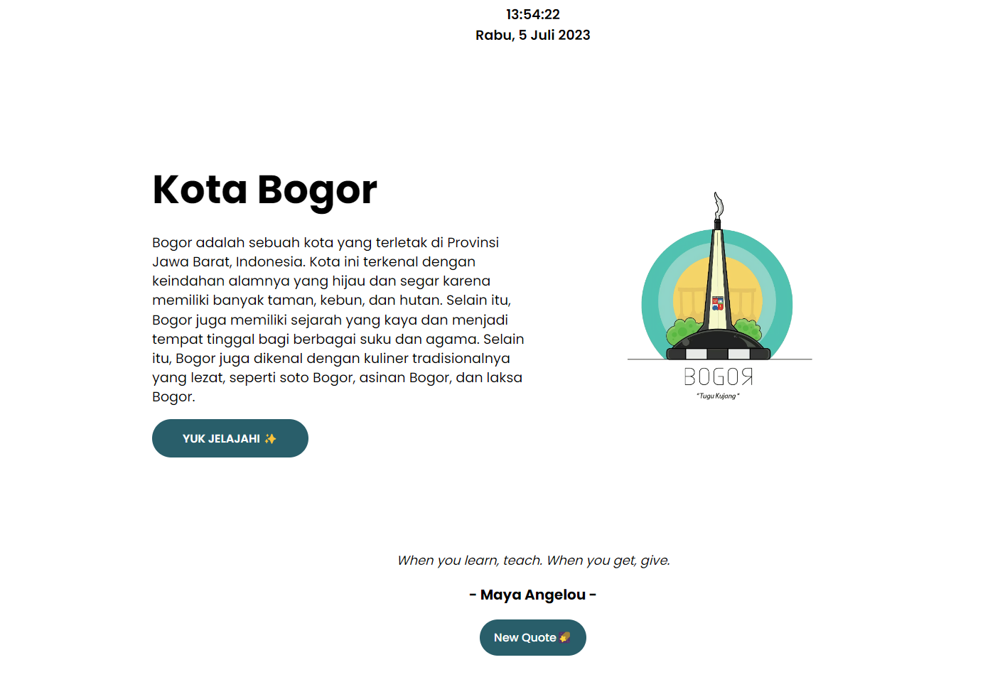

# Kota Bogor

Welcome to Kota Bogor, a website dedicated to providing information about the beautiful city of Bogor. This website was developed as the final project for the Dicoding Basic Web Programming course. It aims to offer a comprehensive overview of Bogor City, from its history to its tourist destinations, all in one convenient platform.

🌐 Website: [**Kota Bogor**](https://nehemiagueldi.github.io/Kota-Bogor)

## Features

Kota Bogor offers the following features to help users explore and learn about Bogor City:

### Landing Page (index.html)
- **Header**: The header section displays the current time and date, providing users with real-time information. This dynamic feature is implemented using JavaScript.

- **Main**: Users can find an introduction to Bogor City, accompanied by an image of the Bogor Kujang Monument, which serves as the city's icon. Additionally, the website displays interesting quotes fetched from the [**Quatable API**](https://api.quotable.io). Users can click the "New Quote" button to generate a new random quote.

- **"Let's Explore ✨" Button**: By clicking this button, users can navigate to the second page (explore.html) to explore Bogor City in more detail.

### Explore Page (explore.html)
- **Header**: Similar to the Landing Page, the header section displays the current time and date. It also provides users with a random name of Bogor City in different languages and a brief description of the city, which changes randomly upon page refresh. The header includes a navigation bar for easy access to different sections of the website.

- **Main**: This section provides detailed information about the history, culinary scene, and tourist attractions of Bogor City. The content is presented in a card format, making it visually appealing and easy to navigate. For the tourist attractions, a slider is implemented to optimize space and enhance user experience. Additionally, there is an aside section that contains personal biodata.

- **Footer**: The footer section provides links to various social media platforms where users can learn more about Bogor City. It includes links to Bogor City's YouTube channel, official website, Twitter, and Facebook pages.

- **Responsive Design**: Both the Landing Page and Explore Page are designed to be responsive and mobile-friendly. The content adapts to different screen sizes, ensuring a seamless browsing experience on mobile and tablet devices.

- **Loader Sign**: Each page includes a loader sign to indicate that the web page has finished loading, providing visual feedback to the user.

## Technologies Used
Kota Bogor is built using the following technologies:

- [**HTML**](https://html.com): The structure and layout of the web pages in Kota Bogor are created using HTML (Hypertext Markup Language), providing a semantic structure for the website.

- [**CSS**](https://www.w3schools.com/css): Cascading Style Sheets (CSS) is used to enhance the visual appearance of Kota Bogor. CSS styles are applied to HTML elements to create an appealing and user-friendly interface.

- [**JavaScript**](https://www.w3schools.com/js): JavaScript is used to add interactivity and dynamic features to the website. It enables functionalities such as displaying the current time and date, fetching quotes from an API, and creating a responsive user experience.
## Deployment

- **Deploy to Vercel**

- **Deploy to Netlify**

- **Clone this repository**

## ☕ Buy me a coffee

 

## 🔗 Links

   
